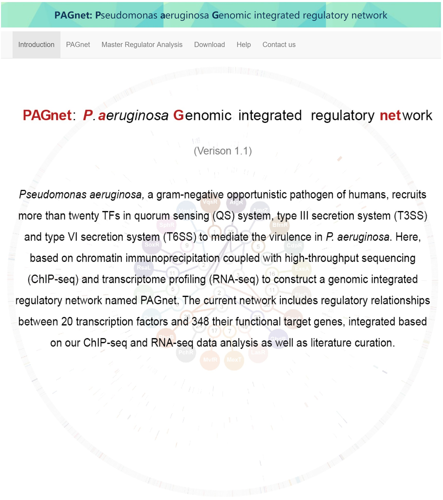

# PAGnet
Welcome to the hompage of **PAGnet** package!

This package provides Master Regulator Analysis (MRA) in Pseudomonas aeruginosa genomic integrated regulatory network (PAGnet).

## Quick Installation

### This package is available under R(>= 3.5).

If you have installed `devtools` package, you only need to call `install_github` function in `devtools` to install `PAGnet`.

```
Please refer to the following commands to install **PAGnet**

install.packages("devtools")

devtools::install_github("CityUHK-CompBio/PAGnet", dependencies=TRUE)

```

## Dependency

**PAGnet** requires the following R/Bioconductor packages for its full function:

- shiny
- shinthemes
- scales
- DT

## Quick Start

Here is a simple but useful example to use **PAGnet** to perform Master Regulator Analysis in default PAGnet.

Before starting the demonstration, you need to load the **PAGnet** package:
```
library(PAGnet)
```

Start analysis:
```
# prepare input for analysis

data(PAGnet)

## Input 1: 'rnet', a dataframe with two colmn (transcription factors and target genes) as regulatory network
## Input 2: 'tflist', the users also need to provide a character vector of TFs (or only interested TFs)
## Input 3: 'signature',  a character vector of locus tag should be provide as signature genes

# Master Regulator Analysis
## Use QS related genes as signature genes

 mra_results <- pagnet.mra(rnet=PAGnet,tflist=tf,signature = qs, 
                            pValueCutoff = 0.05)
                            
# The results will be returned
```
**PAGnet** also provides a local shiny interface to perform MRA in PAGnet with signature gene sets in Gene Ontology (GO) and KEGG databases obtained from Pseudomonas Genome DB.
Call local shiny interface:
```
pagnet.mra.interface()
```



### For more details, pelease refer to our [vignette](https://github.com/CityUHK-CompBio/PAGnet/blob/master/vignettes/PAGnet.pdf)

## Getting help

Should you have any questions about this package, you can either email to the developers listed in the DESCRIPTION part of this package or create an issue in the [issue part](https://github.com/CityUHK-CompBio/PAGnet/issues).
