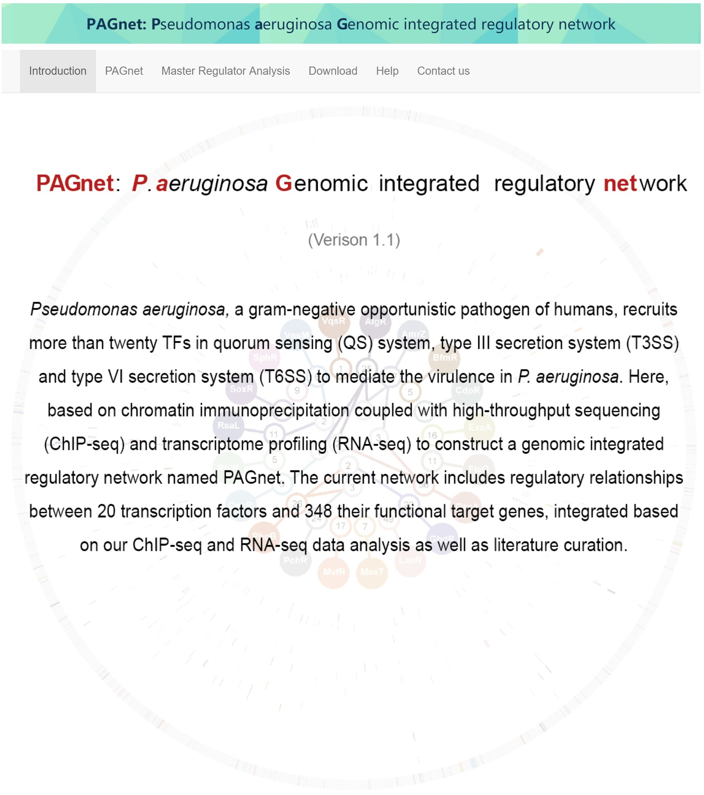

```{r setup, include=FALSE}
knitr::opts_chunk$set(echo = TRUE, eval = TRUE,
                      fig.align   = 'center',
                      fig.width   = 8,
                      fig.height = 4)
```


# Overview
Regulatory networks including virulence-related transcriptional factors (TFs) determine bacterial pathogenicity in response to different environmental cues. Pseudomonas aeruginosa, a Gram-negative opportunistic pathogen of humans, recruits numerous TFs in quorum sensing (QS) system, type III secretion system (T3SS) and Type VI secretion system (T6SS) to mediate the pathogenicity. Although many virulence-related TFs have been illustrated individually, very little is known about their crosstalks and regulatory network. Here, based on chromatin immunoprecipitation coupled with high-throughput sequencing (ChIP-seq) and transcriptome profiling (RNA-seq), we primarily focused on understanding the crosstalks of 19 virulence-related TFs, which led to construction of a virulence regulatory network named PAGnet (Pseudomonas aeruginosa Genomic network) including 48 crosstalk targets.

The PAGnet uncovered the intricate mechanism of virulence regulation and revealed master regulators in QS, T3SS and T6SS pathways. The package **PAGnet** is designed for Master Regulator Analysis (MRA) over a list of regulons from PAGnet. We also provide an online PAGnet platform to provide the analysis for these TFs and more virulence factors.

```{r}
## loading package
library(PAGnet)
```
# Quick Start

## Master Regulator Analysis
The user can choose to use the default PAGnet or to upload their own regulatory network in a predefined format (Locus Tag). 

A dataframe format of default **PAGnet** with two colmn transcription factors and targets is provided for MRA, user could also their own regulatory network in same format as input.

```{r}

  data(PAGnet)

  ##Use defaultPAGnet as regulatory network
  head(PAGnet)

```

The users also need to provide a character vector of TFs (or only interested TFs).
```{r}
  ## define transcription factors in regulatory network
  head(tf)
```

A character vector of locus tag should be provide as signature genes.
```{r}
  ##Use QS related genes as signature genes
  head(qs)
```

The function `pagnet.mra` is used to perform MRA over provided regulatory network. The MRA computes the overlap between the transcriptional regulatory unities (regulons) and the input signature genes using the hypergeometric distribution. Having completed master regulator analysis, a table will be returned.

```{r}
  ## Perform MRA and return results
  mra_results <- pagnet.mra(rnet=PAGnet,tflist=tf,signature = qs, 
                            pValueCutoff = 0.05,pAdjustMethod="BH")

  mra_results
```

##Local shiny interface

The function `pagnet.mra.interface` is used to call a local shiny interface to perform MRA similar to our onlie platform PAGnet. First, the user can choose to use the default PAGnet or to upload their own regulatory network in a predefined format. Second, the user needs to specify a gene signature associated with a biological function or pathway of interest, either by selecting a gene set from public databases or uploading a user-customized gene list. In the current version, the platform provides gene sets in Gene Ontology (GO) and KEGG databases obtained from Pseudomonas Genome DB. Having completed master regulator analysis, a table will be returned with information about each transcription factor’s corresponding gene ID, gene name, number of target genes, total number of hits (all signature genes in the network), observed hits (signature genes in the TF’s regulon), and a p-value calculated based on a hypergeometric test. The table is sorted according to the statistical significance indicated by the p-values, and the top significant TFs can be prioritized as master regulators.

```{r}
  # pagnet.mra.interface()
```



# Need help?

If you have any question/issue, please feel free to contact us.
```
Dr. Xin Deng (xindeng@cityu.edu.hk)
```
or
```
Dr. Xin Wang (xin.wang@cityu.edu.hk)
```

# Session Information
```{r, echo=FALSE}
sessionInfo()
```

# References
